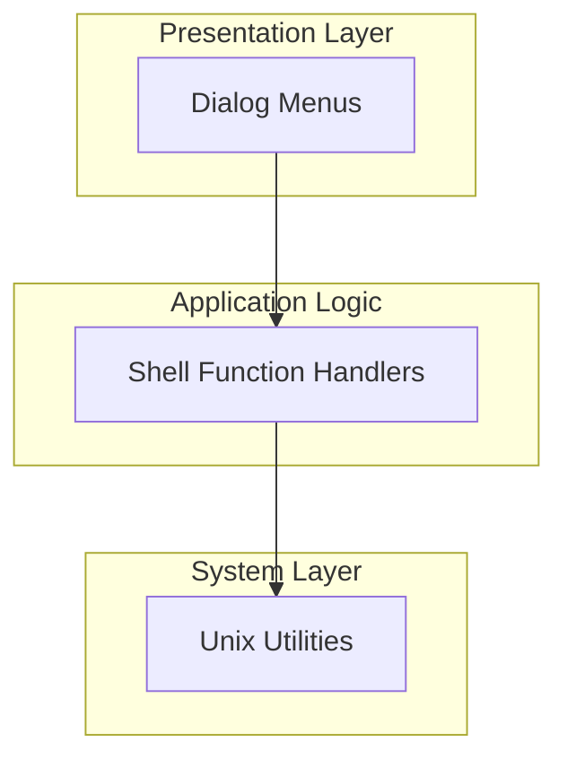
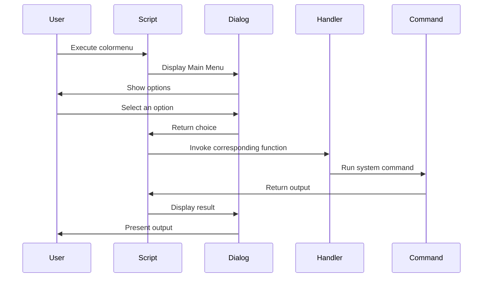
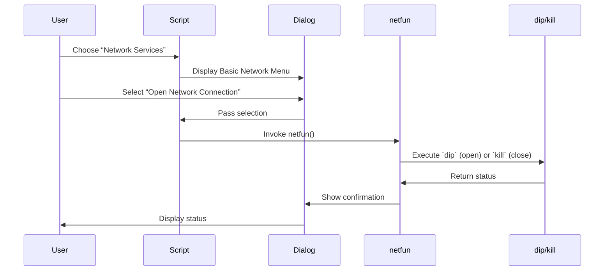

# Color Menu Feature Documentation

## Overview

Color Menu is a bash shell script (v0.4) that provides an interactive, dialog-based menu interface for common UNIX tasks. New or casual users can perform network operations, local file management, system monitoring, and more without memorizing individual commands. Administrators can customize environment variables for hosts, directories, and friends to tailor menus to their environment .

By abstracting commands like `telnet`, `ftp`, `finger`, `netstat`, and others behind descriptive menu options, Color Menu lowers the learning curve for UNIX systems. It fits on any machine with `dialog` v0.4 installed and can be deployed per-user or system-wide .

## Architecture Overview

## Component Structure

### 1. Presentation Layer

#### **Dialog Menus** (`colormenu`)

- Purpose: Render interactive menus and capture user selections.
- Responsibilities:
  - Display the Main Menu, Network Services, Local Services, and various submenus.
  - Write choices to `/tmp/tmpchoice` and clean up temp files.
- Key Variables:
  - `version` – Script version label (`Color Menu v0.4`).
  - Environment variables: `SHLACT1`, `SHLACT2`, `DOSDRV1`, `DOSDRV2`, `FRIEND1`, `FRIEND2` .
- Menus Defined:
  - **Main Menu**: Network Services, Local Services, Quit.
  - **Basic Network Services**: Telnet, News, IRC, Mail, Archie, FTP, Finger, DNS lookup, WWW, Connection control.
  - **Local Services**: Program Menu, Directory Manipulation, System Monitors, File Search.
  - Submenus for each service (e.g., `netfun`, `localdir`, `sysmon`).

### 2. Application Logic

#### **Shell Function Handlers** (`colormenu`)

- Purpose: Map menu selections to corresponding operations.
- Main Functions:
  - `main` – Entry point looping the Main Menu.
  - `basefun` – Handles Basic Network Services submenu.
  - `netfun` – Open or close SLIP (dip) connections.
  - `webfun` – Launch Lynx or Gopher clients.
  - `telfun` – Telnet to predefined or custom hosts.
  - `netfinger` – Finger user information.
  - `archiefun` – Archie file search and telnet.
  - `ftpfun` – FTP to preset or custom sites.
  - `mailfun` – Choose Pine or Elm mail client.
  - `localfun` – Handles Local Services submenu.
  - `localprog` – Launch local utilities (file manager, editor, GIF viewer, etc.).
  - `localdir` – Directory viewing, navigation, and disk usage.
  - `sysmon` – System monitoring commands.
- Pattern:
  1. Infinite loop (`while [ 0 ]`).
  2. Show `dialog` menu and capture return code.
  3. Clean up `/tmp/tmpchoice` and `/tmp/tmpmsg`.
  4. Invoke next function or exit on cancel (exit codes 1 or 255) .

### 3. System Layer

#### **Unix Utilities** (External Dependencies)

- dialog v0.4 – Renders menus.
- Networking: `dip`, `telnet`, `nslookup`.
- File transfers: `ftp`, `archie`.
- Browsing: `lynx`, `gopher`.
- Communication: `finger`, `tin`, `irc`, `pine`, `elm`.
- System info: `free`, `w`, `netstat`, `top`, `df`, `ls`, `pwd`.
- File search: `grep` on `/usr/local/lib/lists/*`.

## Feature Flows

### 1. Main Interaction Flow

### 2. Network Connection Flow

## State Management

- Each menu resides in its own infinite loop (`while [ 0 ]`).
- Exit codes from `dialog` (1 or 255) trigger cleanup and script termination or return to a higher-level menu.
- State transitions occur via function calls.

## Integration Points

- Environment variables for customization:
  - `SHLACT1`, `SHLACT2` – Shell hosts for Telnet.
  - `DOSDRV1`, `DOSDRV2` – Default directories for navigation.
  - `FRIEND1`, `FRIEND2` – Default targets for `finger`.
- External tools must be in `$PATH` or scripted via `$HOME/bin` overrides .
- References local lists at `/usr/local/lib/lists/*` for file search.

## Error Handling

- After each `dialog` call, the script checks `$?`.  
  - `0`: proceed.  
  - `1` or `255`: clean `/tmp/tmpchoice` and `/tmp/tmpmsg`, then exit or return.
- Temporary files are removed after use to avoid stale data .

## Dependencies

- [badge:required] `dialog` v0.4  
- [badge:optional] `ncftp` (for “Go For File” feature)  
- Standard UNIX utilities (`ftp`, `telnet`, `archie`, `grep`, etc.)

## Key Functions Reference

| Function    | Responsibility                                          |
|-------------|---------------------------------------------------------|
| `main`      | Launch and loop through Main Menu                       |
| `basefun`   | Basic network services submenu                          |
| `netfun`    | Open/close SLIP connections                             |
| `webfun`    | Launch Lynx or Gopher browsers                          |
| `telfun`    | Telnet sessions                                         |
| `netfinger` | Finger user information                                 |
| `archiefun` | Archie file search and telnet                           |
| `ftpfun`    | FTP to preset or user-specified sites                   |
| `mailfun`   | Mail client selection (Pine, Elm)                       |
| `localfun`  | Local services submenu                                  |
| `localprog` | Launch local utilities (file manager, editor, etc.)     |
| `localdir`  | Directory navigation and disk usage                     |
| `sysmon`    | System monitoring (memory, users, netstat, top, disk)   |